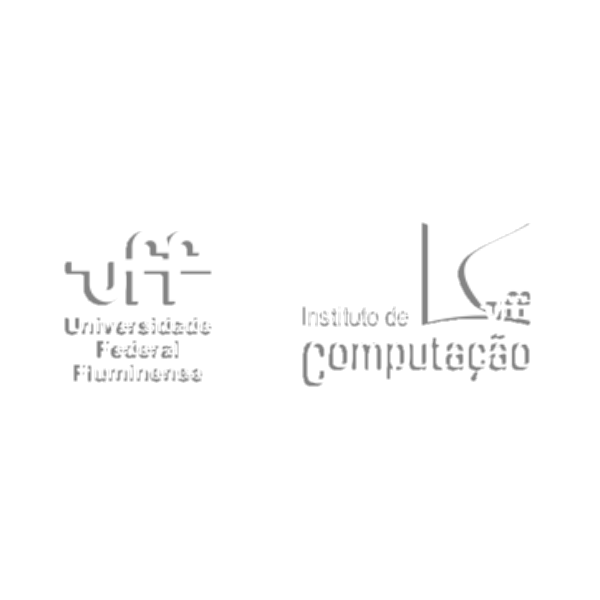

  
  
  <h1>Semana de Computação UFF - Git and GitHub Workshop</h1>

 &emsp; Este repositório foi criado como parte do Workshop de Git and GitHub para a VII Semana de Computação da Universidade Federal Fluminense (UFF). O objetivo deste workshop é ensinar conceitos básicos de controle de versão com Git e demonstrar como utilizar o GitHub para colaboração em projetos de software. Além disso, vamos construir um projeto prático em Python durante o workshop. 

## **Links importantes:**

 

- [Guia prático de git e github](https://github.com/JohKemPo/Github-Guide)
- [Guia prático de Markdown](https://github.com/JohKemPo/Github-Guide/blob/main/Markdown%20.md)
- [Guia prático de Customização de readme [EM BREVE - EM DESENVOLVIMENTO]](https://github.com/JohKemPo/README-Custom)
- [Respostas cases práticos](https://github.com/JohKemPo/VII-Semana-de-Computa-UFF-Github-Respostas)

 

### **Divirta-se programando!**

 

## **Licença**
Este projeto é licenciado sob a Licença MIT - consulte o arquivo LICENSE para obter detalhes.

<h1 id="Equipe">Equipe</h1> 

|     Desenvolvedor              |           GitHub             |       LinkedIn     |
|--------------------------------|------------------------------|--------------------|
|👤 João Vitor Moraes            |<https://github.com/JohKemPo>   |<https://www.linkedin.com/in/joao-vitor-de-moraes/>|

